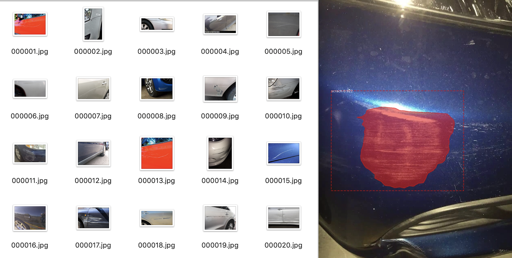

# Mask R-CNN for train your own dataset
## Introduction
This is an Step-by-step tutorial of Mask R-CNN - How to train your own dataset on Python 3, Keras, and TensorFlow.Using [Mask R-CNN](https://arxiv.org/abs/1703.06870) based on https://github.com/matterport/Mask_RCNN.  
  
  

## 手順
### データの用意
* googleの写真を利用したい場合、[google_images_download](https://github.com/hardikvasa/google-images-download)と推薦します。  
 ```bash
 pip install google_images_download  
 googleimagesdownload -k "キーワード" -l 100
 ```
### 学習データアノテーションと処理
* 使用ツール：[Labelme](https://github.com/wkentaro/labelme)  
 ```bash
 # python3
 conda create --name=labelme python=3.6  
 source activate labelme  
 labelme
 ```
* アノテーションルール  

* train_dataの準備  
 [train_data](train_data)のようにフォルダとデータをご用意ください。  
    
  pic    
  <div align=center></div>

  json   
  <div align=center></div>  
  
  cv2_mask  
  <div align=center></div>  
  
  labelme_json  
  <div align=center></div>  
  labelme2dataset  
  <div align=center></div> 
  


## train.py/inference.pyの編集  
* [demo.ipynb](samples/demo.ipynb)の編集 
 

