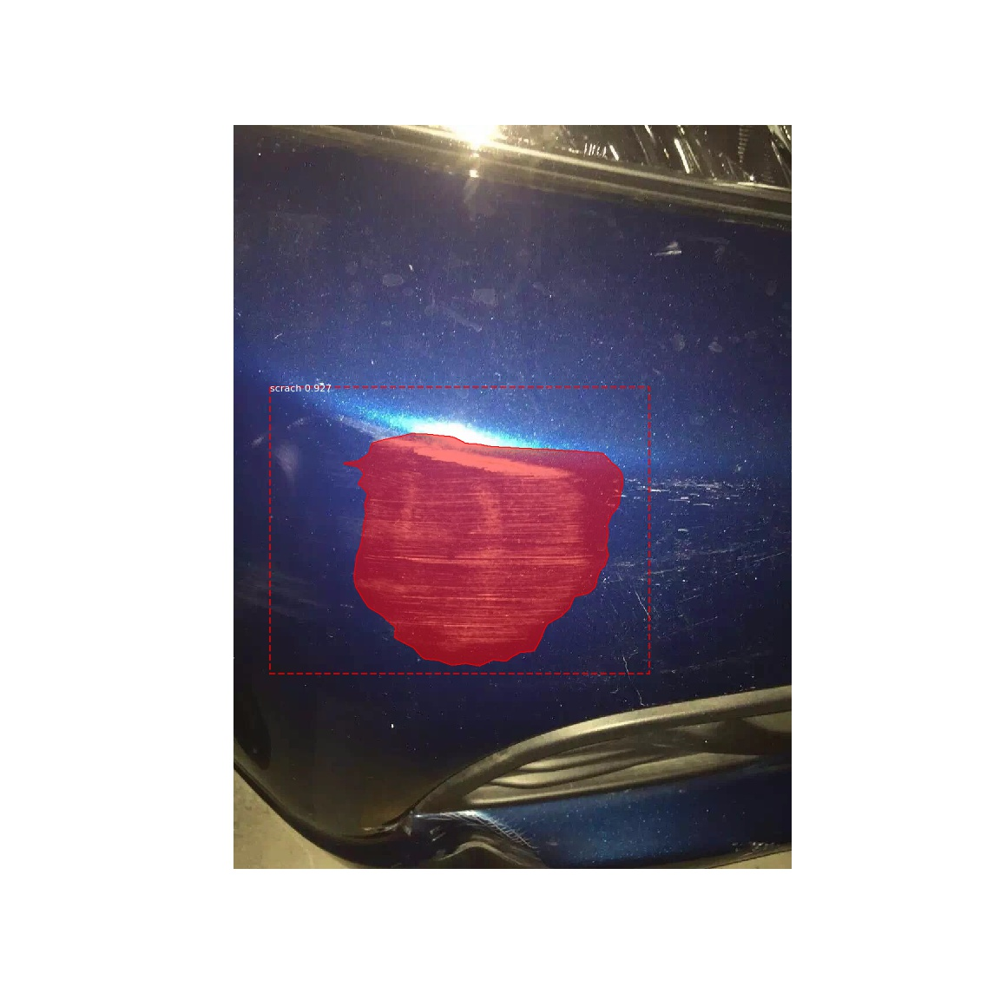

# Mask R-CNN for train your own dataset
## Introduction
This is an Step-by-step tutorial of Mask R-CNN - How to train your own dataset on Python 3, Keras, and TensorFlow.Using [Mask R-CNN](https://arxiv.org/abs/1703.06870) based on https://github.com/matterport/Mask_RCNN. 

手順:
* 学習データの用意。googleの写真を利用したい場合、[google_images_download](https://github.com/hardikvasa/google-images-download)と推薦します。  
 ```bash
 pip install google_images_download  
 googleimagesdownload -k "キーワード" -l 100` 
 ```
* 学習データアノテーションと処理。推奨ツール：[Labelme](https://github.com/wkentaro/labelme)と推薦します。  
* [demo.ipynb](samples/demo.ipynb)の編集 
 

